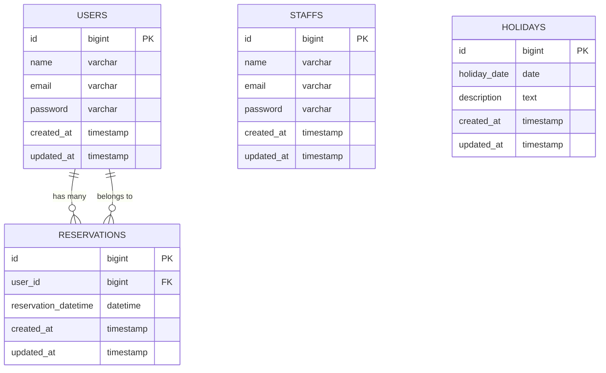

# 🏥 動物病院ホームページ - 作業01: 基盤構築完了

**作業日**: 2025-07-14  
**担当者**: [担当者名]  
**ステータス**: ✅ 完了

## 📋 実施した作業内容

### 1. データベース設計 🗄️

#### 作成したテーブル
| テーブル名 | 説明 | 主要フィールド |
|------------|------|----------------|
| `users` | 顧客情報 | id, name, email, password |
| `staffs` | スタッフ情報 | id, name, email, password |
| `reservations` | 予約情報 | id, user_id, reservation_datetime |
| `holidays` | 休診日情報 | id, holiday_date, description |

#### マイグレーションファイル
- `2025_07_14_053107_create_staffs_table.php`
- `2025_07_14_053114_create_reservations_table.php`
- `2025_07_14_053119_create_holidays_table.php`

### 2. Eloquentモデル作成 🏗️

#### 作成したモデル
```php
// User.php - 顧客モデル
class User extends Authenticatable
{
    // 予約との関係
    public function reservations(): HasMany
    {
        return $this->hasMany(Reservation::class);
    }
}

// Staff.php - スタッフ認証モデル
class Staff extends Authenticatable
{
    // 認証可能なモデルとして設定
}

// Reservation.php - 予約モデル
class Reservation extends Model
{
    // ユーザーとの関係
    public function user(): BelongsTo
    {
        return $this->belongsTo(User::class);
    }
}

// Holiday.php - 休診日モデル
class Holiday extends Model
{
    // 休診日管理
}
```

### 3. マルチ認証システム設定 🔐

#### 認証ガード設定 (`config/auth.php`)
```php
'guards' => [
    'web' => [
        'driver' => 'session',
        'provider' => 'users',  // 顧客用
    ],
    'admin' => [
        'driver' => 'session',
        'provider' => 'staffs', // スタッフ用
    ],
],
```

#### プロバイダー設定
```php
'providers' => [
    'users' => [
        'driver' => 'eloquent',
        'model' => App\Models\User::class,
    ],
    'staffs' => [
        'driver' => 'eloquent',
        'model' => App\Models\Staff::class,
    ],
],
```

## 🎯 達成した機能

### ✅ 完了項目
- [x] データベーステーブル設計
- [x] Eloquentモデル作成と関係設定
- [x] マルチ認証システム基盤
- [x] マイグレーション実行
- [x] Laravel Breeze統合

### 🔄 認証システムの仕組み
| 利用者タイプ | ログインURL | 認証ガード | 説明 |
|-------------|-------------|------------|------|
| 👤 顧客 | `/login` | `web` | 一般ユーザー向け |
| 👩‍⚕️ スタッフ | `/admin/login` | `admin` | 管理者向け |

## 📊 データベース構造図



## 🔧 セットアップ手順（チーム向け）

### 前提条件
- Laravel Breeze がインストール済み
- データベース接続設定完了（`.env`ファイル）

### 実行コマンド
```bash
# マイグレーション実行
php artisan migrate

# 開発サーバー起動
php artisan serve
```

## 📝 次の作業ステップ

### 🚀 次回実装予定
1. **管理画面コントローラー作成**
   - AdminAuthController
   - ReservationController
   - HolidayController

2. **フロントエンド機能**
   - 予約カレンダーUI
   - 休診日表示

3. **静的ページ**
   - トップページ更新
   - 病院紹介ページ
   - お客様の声ページ

## 🔍 確認事項

### テスト方法
```bash
# データベーステーブル確認
php artisan tinker
>>> \App\Models\User::count()
>>> \App\Models\Staff::count()
>>> \App\Models\Reservation::count()
>>> \App\Models\Holiday::count()
```

### ファイル変更箇所
- `app/Models/` - 新規モデル追加
- `database/migrations/` - 新規マイグレーション
- `config/auth.php` - マルチ認証設定

## ⚠️ 注意事項

1. **ブランチ運用**: `feature/database-setup` から `develop` へマージ済み
2. **コンフリクト対策**: `config/auth.php` は共通ファイルのため注意
3. **環境設定**: `.env` のデータベース設定確認必須

## 📞 質問・相談

この作業について質問がある場合は、以下で相談してください：
- **Slack**: #development チャンネル
- **GitHub**: Issues またはプルリクエスト
- **直接相談**: データベース設計に関する疑問など

---

**📅 次回作業予定**: 管理画面とフロントエンド機能の実装  
**🎯 目標**: 予約システムの基本機能完成